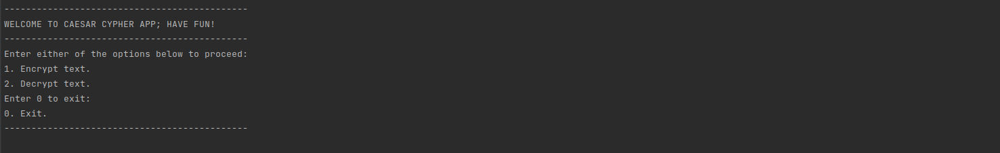
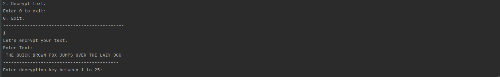

# CAESAR-CIPHER-APP
This is a web-app that prompts the user to enter a text and 
provides the option to either encode or decode it using a key.

#### By **Marvin Macharia**
## Description




## Setup/Installation Requirements
* Fork/Clone the repository
```
   $ git clone https://github.com/andreassenmarvin/Caesar-Cipher-App.git
```
* Install JDK.
* Install IntelliJ.
* Install gradle.
* Open app with IntelliJ.

## Known Bugs
#### No known bugs
## Technologies Used
* Java
* Gradle
* Junit
## Support and contact details
Incase of any contributions,query or issues,you can reach me through the email below:
**machariamarvin625@gmail.com**
### License
This project is licensed under the [MIT License](https://github.com/marvinandreassen/Caesar-Cipher-App/blob/master/LICENSE)